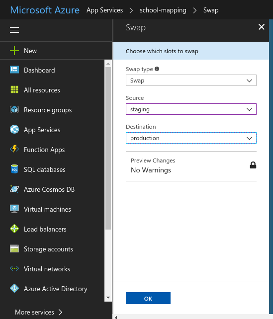

############################
How to deploy an application
############################

In the UNICEF Office of Innovation team, we use `Azure Web Apps`_ to deploy our applications to the cloud.

This guide will walk you through the deployment process of a WebApp in the Azure environment.
At the end of this guide you will be able to develop, tag and deploy the tagged version of the application to the azure servers.

***************************************
Create a feature branch for development
***************************************

While in development, it is useful to make all of your changes in a feature branch named accordingly to the task.

For example, if we want to implement a new feature to show information about the country the user clicked in, we could name the branch accordingly to this task using the command below:

.. code:: bash

    git checkout -b show_country_information

We can implement our features in this branch and submit a Pull Request to merge it into the master branch of the app.

Create a tag
============

Once your changes get merged into master, we can create a tag for the current version of the application.
Make sure to name the tag accordingly with the project's convention and following the `semantic versioning`_ rules.

For example, suppose you made a simple fix in the application and your changes just got merged from the branch "fix_bug_61" into master.
In this project, tags are named using the convention "vX.X.X" and the last tag is "v1.1.1".

Since your fix is a `patch`_, you can create the tag "v1.1.2" with the command 

.. code:: bash

    git tag v1.1.2

Always remember to push the tag to the public repository to make others aware of the current project version.
You can push your tags to the public repository with the command.

.. code:: bash

    git push origin master --tags

*************************
Deploying the application
*************************

After our changes get merged into master, we can deploy the application to Azure.

Each UNICEF's application in Azure have two main deployment slots: production and staging.

In the production slot lies the code that you can see in your browser, the application as it is, available for the final user.

The staging slot contains the code preparing to be released to production. 
Once your code is in this slot you can take a look in a private url to see how your code will respond in production.

If everything looks correct in staging, you can swap the code in production with the code in the staging slot to make your changes available for all users.

Adding Azure remote for repository
==================================

The first thing we need to do is add the staging remote to our local git repository.

Within the project directory, you can add the stagin remote for the project issuing the command below.

.. code:: bash

    git remote add staging https://<username>@<project-name>-staging.scm.azurewebsites.net:443/<project-name>.git

Make sure to change <project-name> with the project name you are working on and <username> for your username set in the deployment credentials in Azure.

Pushing changes to the staging slot
===================================

Push changes to the staging repository issuing the command below

.. code:: bash

    git push staging master

This command will push the current version in your master branch to staging in azure.

To push a specific tag to Azure, run:

.. code:: bash

    git push staging tagname:master

Replace "tagname" with the tag you want to push to azure.

Swap staging to production (Web)
================================

The last step to make your changes available to the public is swap the staging environment with the production environment.

Once your code is working properly in the staging environment, you can swap it with production.
Swapping those slots means that the code in the staging environment now answers for the production environment and the code in the production environment now lives in the staging environment.

If a bug was introduced in your changes and it was not caught in the staging environment and is now in the production environment, all you have to do to revert it to the last working version of the application is to swap it again.

To make the swap, go to the `Azure Panel`_ > App Services, find the project you are working on and select it.

.. image:: ../_static/deployguide-appservices.png

In the overview section you will find the "Swap" button, you can click in it.

.. image:: ../_static/deployguide-swap.png

Make sure to select in the Swap panel "staging" as source and "production" as destination.

Click OK to make the swap. You will get a notification once it finishes.

To replace your changes for the last working version of the application, just repeat this procedure.

Swap staging to production (CLI)
================================

If you have the right permissions in place you can make the swap using the `Azure CLI`_.

To do this, make sure you are in the ASM mode running

.. code:: bash

    azure config mode --help

Then you can use

.. code:: bash

    azure site swap <appname>

.. _`Azure Web Apps`: https://docs.microsoft.com/en-us/azure/app-service/
.. _`semantic versioning`: https://semver.org/
.. _`patch`: https://semver.org/#spec-item-6
.. _`Azure Panel`: https://portal.azure.com
.. _`Azure CLI`: https://www.npmjs.com/package/azure-cli
